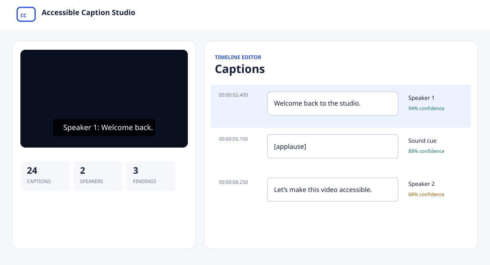

# Accessible Caption Studio

Accessible Caption Studio is a private, local-first application for creating accessible
captions for prerecorded video and audio. It combines automatic speech recognition,
anonymous speaker labeling, meaningful sound descriptions, an accessible correction
workflow, and production-ready exports in one portfolio application.



## What it does

- Imports MP4, MOV, WebM, MP3, WAV, and M4A files
- Imports individual YouTube videos when you have permission to download them
- Transcribes English speech and singing locally with Whisper word timestamps
- Labels voices anonymously as `Speaker 1`, `Speaker 2`, and so on
- Suggests SDH-style cues such as `[applause]`, `[door closes]`, and `[music]`
- Creates readable caption segments instead of dumping a raw transcript
- Checks timing, overlap, duration, line length, line count, and reading speed
- Provides synchronized video/audio preview and keyboard playback controls
- Offers persistent light and dark appearance modes under Settings
- Supports add, edit, delete, split, merge, reorder, and undo
- Saves projects automatically so they can be reopened later
- Exports UTF-8 SRT, WebVTT, accessible HTML transcripts, and captioned MP4 video
- Shows project, model, and temporary storage and lets users clear caches safely

All analysis runs on the computer after the model files have been downloaded. Source
media, tokens, transcripts, and exports are stored under the ignored `storage/` folder
and are never committed to Git.

## Quick start on macOS

Requirements:

- macOS with any working Python installation for the private installer
- FFmpeg and FFprobe on the `PATH`
- Internet access for the first model downloads and YouTube imports
- Several gigabytes of free disk space for the optional ML models

Double-click **Start Accessible Caption Studio.command** in Finder. The first launch uses
`uv` to download a project-local Python 3.11 runtime, creates an isolated environment,
and installs the application and local ML components. It does not replace the system
Python. That setup can take several minutes. Later launches open the studio directly.

For anonymous speaker labels:

1. Create a free Hugging Face account.
2. On Apple Silicon, accept the terms for
   [pyannote Community-1](https://huggingface.co/pyannote/speaker-diarization-community-1).
   Intel Macs instead use the compatible
   [speaker-diarization 3.1](https://huggingface.co/pyannote/speaker-diarization-3.1)
   model because current PyTorch packages do not support Community-1 on Intel macOS;
   also accept the [segmentation 3.0 terms](https://huggingface.co/pyannote/segmentation-3.0).
3. Create a read token.
4. Open **Settings** in the studio and save the token.

The token is saved only in `storage/settings.json` with owner-only file permissions.

## Developer setup

```bash
python3 -m venv .venv
.venv/bin/python -m pip install -U pip
.venv/bin/python -m pip install -e ".[ml,dev]"
.venv/bin/accessible-caption-studio start
```

Fast development without installing the large ML extras:

```bash
.venv/bin/python -m pip install -e ".[dev]"
.venv/bin/pytest
.venv/bin/ruff check .
```

Automatic analysis keeps the Whisper transcript and reports a visible warning when an
optional speaker or sound model is unavailable. Caption import, editing, validation,
project management, and text exports remain usable without those optional models.

## Typical workflow

1. Upload a local media file or paste a YouTube URL.
2. Leave the tab open while the app extracts audio and runs the three local models.
3. Preview the generated captions in sync with the media.
4. Optionally correct uncertain captions, speakers, sounds, or timing.
5. Select **Check captions** and address useful findings.
6. Export SRT, VTT, an HTML transcript, or a captioned MP4.
7. Return to **All projects** at any time; changes save automatically.

Captioned-video rendering reports the encoded percentage and processed media time. When
any export finishes, a completion dialog opens automatically with its filename, project
storage location, file size, and a Download button. The rendered master remains under
`storage/projects/<project-id>/exports/`; downloading saves another copy through the
browser's normal Downloads location.

Imported SRT or VTT captions skip automatic analysis and open directly in the editor.
Choose **Analyze** through the API if you later want to replace them with automatic output.

## Privacy, accuracy, and limitations

- Whisper, pyannote, and the Audio Spectrogram Transformer are probabilistic models.
  They can miss words, confuse speakers, or describe a sound incorrectly.
- Live singing is decoded across the full audio so music-heavy passages are not discarded,
  but unusual pronunciation and loud accompaniment can still require manual correction.
- Speaker labels are deliberately anonymous. The app never attempts voice identification.
- An automatic check is not certification of WCAG, FCC, ADA, or other legal compliance.
- Captioned MP4 export is available for video projects, not audio-only projects.
- YouTube availability can change and some videos cannot legally or technically be
  downloaded. The app disables playlists and returns the downloader's failure reason.
- The initial model downloads are large. Settings shows their disk use and can remove
  them without deleting projects.
- English is the optimized v1 language. The model adapter is isolated so multilingual
  Whisper models can be added later.

## Architecture

```text
Local file / YouTube
        ↓
FFprobe validation → private project folder
        ↓
FFmpeg 16 kHz mono analysis audio
        ↓
Whisper words ─┬─ pyannote speaker turns ─┬─ AudioSet sound events
               └──── caption composition ──┘
                              ↓
            editor + accessibility validation
                              ↓
               SRT / VTT / HTML / captioned MP4
```

The FastAPI server binds only to `127.0.0.1`. Pydantic models define all persisted data
contracts. Background analysis and MP4 jobs persist progress to disk, while source and
export files are streamed by the local server instead of being loaded into memory.

See [docs/ARCHITECTURE.md](docs/ARCHITECTURE.md) for the data contracts, API surface,
failure behavior, and extension points.

## Quality checks

```bash
pytest
ruff check .
```

The suite covers caption parsing and round trips, segmentation, speaker assignment,
sound-event merging, accessibility findings, project persistence, API editing and export,
storage cleanup boundaries, real FFmpeg media inspection, and captioned rendering when
FFmpeg's subtitle filter is available.

## Troubleshooting

If a previous version stopped with `OMP: Error #15`, close its Terminal window and launch
again after updating the project. Whisper now runs in a separate local process so its
CTranslate2 runtime cannot collide with the PyTorch runtime used for speakers and sounds.
Do not enable `KMP_DUPLICATE_LIB_OK`; that workaround can hide incorrect model behavior.
