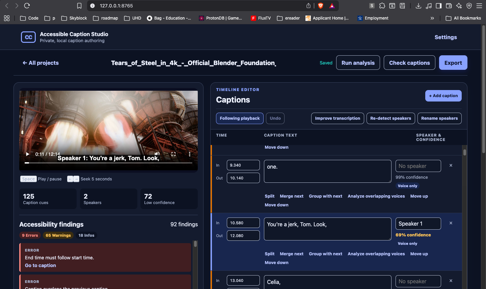
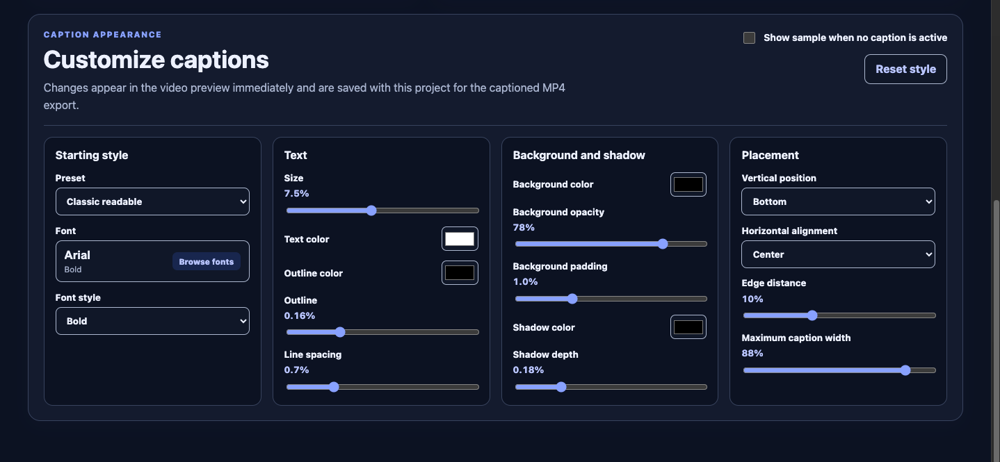
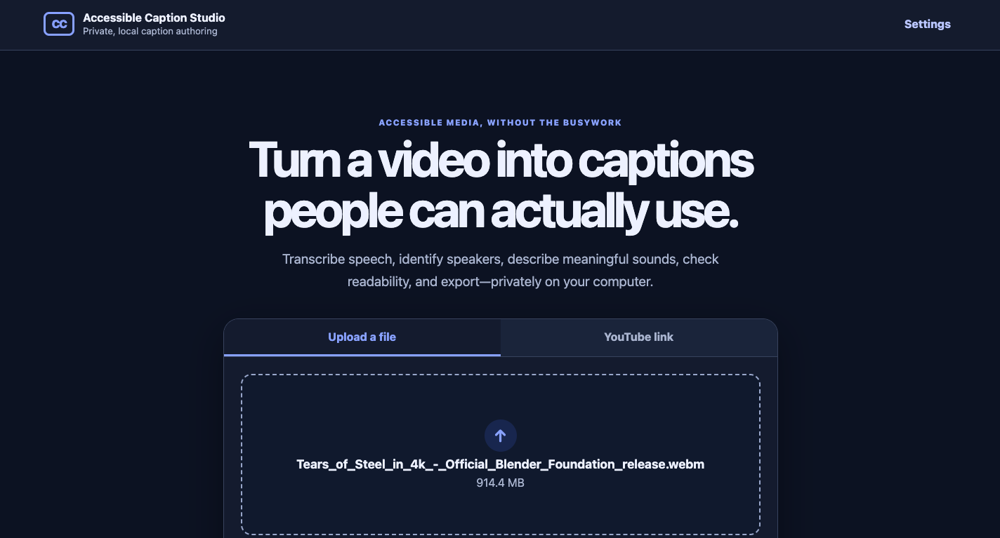
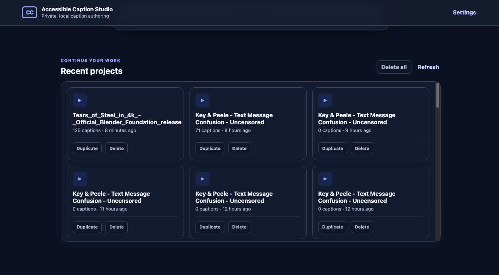

# Accessible Caption Studio

Accessible Caption Studio is a private, local-first application for creating accessible
captions for prerecorded video and audio. It combines automatic speech recognition,
anonymous speaker labeling, meaningful sound descriptions, an accessible correction
workflow, and production-ready exports in one portfolio application.

## Screenshots

### Caption editor



### Caption customization



### Media upload



### Recent projects



## What it does

- Imports MP4, MOV, WebM, MP3, WAV, and M4A files
- Imports individual YouTube videos when you have permission to download them
- Transcribes English speech and singing locally with selectable Fast or Accurate Whisper
  word timestamps
- Adaptively rechecks suspicious speech gaps so legitimate repeated dialogue is preserved
- Labels voices anonymously as `Speaker 1`, `Speaker 2`, and so on
- Uses anonymous face tracks and audio-correlated mouth activity to stabilize video speakers
- Optionally outlines the active speaker in the local player without saving face images
- Lets users add local display names while preserving anonymous internal speaker IDs
- Splits captions automatically when the detected speaker changes
- Lets you re-detect speakers with conservative Auto mode or an exact count from 1–8
- Offers a non-destructive Improve transcription preview for existing projects
- Represents two simultaneous speakers as separately editable lines in one timeframe
- Offers an on-demand, local two-voice separation pass for short overlapping intervals
- Suggests SDH-style cues such as `[applause]`, `[door closes]`, and `[music]`
- Creates readable caption segments instead of dumping a raw transcript
- Checks timing, overlap, duration, line length, line count, and reading speed
- Keeps long accessibility reports and caption timelines in matched, independently scrolling panels
- Provides synchronized video/audio preview and keyboard playback controls
- Keeps the active timeline caption centered during playback with a user-controlled follow mode
- Offers persistent light and dark appearance modes under Settings
- Supports add, edit, delete, split, merge, reorder, and undo
- Saves projects automatically so they can be reopened later
- Exports UTF-8 SRT, WebVTT, accessible HTML transcripts, and captioned MP4 video
- Shows project, model, and temporary storage and lets users clear caches safely

All analysis runs on the computer after the model files have been downloaded. Source
media, transcripts, and exports are stored under the ignored `storage/` folder
and are never committed to Git.

## Quick start on macOS

Requirements:

- macOS with any working Python installation for the private installer
- FFmpeg and FFprobe on the `PATH`
- Internet access for the first model downloads and YouTube imports
- Several gigabytes of free disk space for the optional ML models

Double-click **Start Accessible Caption Studio.command** in Finder. The first launch uses
`uv` to download a project-local Python 3.11 runtime, creates an isolated environment,
and installs the application and local ML components. It does not replace the system
Python. That setup can take several minutes. Later launches open the studio directly.

Anonymous speaker labels use SpeechBrain's public ECAPA-TDNN VoxCeleb model. It downloads
automatically on first use, requires no account or access token, and is cached locally for
later offline analysis. Clean voice samples derived from Whisper timestamps are grouped
conservatively and assigned order-of-appearance labels such as `Speaker 1`. Short or
ambiguous samples may join established voices but cannot create another person.

For video, a separate CPU worker uses pinned OpenCV YuNet and SFace models to detect faces,
track them in a shot, and anonymously match recurring faces across camera cuts. Mouth
movement and speech timing decide which recurring face is speaking. That independent face
signal is reconciled with ECAPA voice clusters, so two alternating faces can correct a voice
cluster that mistakenly merged them. Offscreen and obscured speakers fall back to audio.
The app stores only anonymous identity IDs, normalized boxes, timestamps, and confidence;
temporary crops and embeddings are deleted. **Show active speaker** in Settings controls the
optional player outline. **Rename speakers** adds user-provided display names to captions
and exports.

Accurate mode uses the public, token-free `distil-large-v3` model; Fast mode retains
`small.en`. The selected default is stored locally in Settings. After the primary pass,
Silero speech detection independently maps likely speech and the studio retranscribes
uncovered intervals, long gaps, and low-confidence passages without previous-text prompts.
Results are reconciled by audio timestamp—not by text alone—so the same phrase spoken twice
remains two utterances. Existing projects can run the same process through **Improve
transcription**, which presents a preview and preserves edited captions for review.
Intel Macs use the final compatible prebuilt OpenCV 4.10 wheel so setup does not attempt a
large, unreliable source compilation.

If Auto mode estimates the wrong cast size, choose **Re-detect speakers** in the timeline,
select **Exact number**, and enter the known number of speakers. The studio reuses the saved
audio and word timestamps, then shows label changes and proposed caption joins or splits in
a preview. Nothing changes until you choose **Apply changes**.

Normal analysis uses short word-aligned samples and remains the fast default. If two people
talk over one another, choose **Analyze overlapping voices** on that caption. The optional
SpeechBrain SepFormer model separates up to two voice tracks in a maximum 30-second interval
and presents editable results before changing the project. The first use downloads another
local model and is intentionally slower on Intel Macs.

## Developer setup

```bash
python3 -m venv .venv
.venv/bin/python -m pip install -U pip
.venv/bin/python -m pip install -e ".[ml,dev]"
.venv/bin/accessible-caption-studio start
```

Fast development without installing the large ML extras:

```bash
.venv/bin/python -m pip install -e ".[dev]"
.venv/bin/pytest
.venv/bin/ruff check .
```

Automatic analysis keeps the Whisper transcript and reports a visible warning when an
optional speaker or sound model is unavailable. Caption import, editing, validation,
project management, and text exports remain usable without those optional models.

## Typical workflow

1. Upload a local media file or paste a YouTube URL.
2. Leave the tab open while the app extracts audio and runs the three local models.
3. Preview the generated captions in sync with the media.
4. If dialogue is missing, use **Improve transcription** and review the recovery preview.
5. If needed, use **Re-detect speakers** with the known cast size and review the preview.
6. Optionally correct uncertain captions, speakers, sounds, or timing.
7. Select **Check captions** and address useful findings.
8. Export SRT, VTT, an HTML transcript, or a captioned MP4.
9. Return to **All projects** at any time; changes save automatically.

Captioned-video rendering reports the encoded percentage and processed media time. When
any export finishes, a completion dialog opens automatically with its filename, project
storage location, file size, and a Download button. The rendered master remains under
`storage/projects/<project-id>/exports/`; downloading saves another copy through the
browser's normal Downloads location.

Cancel immediately changes a running job to **Cancelling**, terminates its active local
worker process, removes partial output, and finishes as **Cancelled**. Completed project
data is applied only after its worker exits successfully.

Imported SRT or VTT captions skip automatic analysis and open directly in the editor.
Choose **Analyze** through the API if you later want to replace them with automatic output.

## Privacy, accuracy, and limitations

- Whisper, ECAPA voice clustering, SFace matching, and the Audio Spectrogram Transformer are probabilistic models.
  They can miss words, confuse speakers, or describe a sound incorrectly.
- Live singing is decoded across the full audio so music-heavy passages are not discarded,
  but unusual pronunciation and loud accompaniment can still require manual correction.
- Speaker labels and face tracks are deliberately anonymous. The app never attempts voice
  or facial identification, and visual evidence requires a sufficiently visible face.
- Simultaneous-speech separation is limited to two voices and may retain noise or miss words;
  proposals require user review before they replace existing captions.
- An automatic check is not certification of WCAG, FCC, ADA, or other legal compliance.
- Captioned MP4 export is available for video projects, not audio-only projects.
- YouTube availability can change and some videos cannot legally or technically be
  downloaded. The app disables playlists and returns the downloader's failure reason.
- The initial model downloads are large. Settings shows their disk use and can remove
  them without deleting projects.
- English is the optimized v1 language. The model adapter is isolated so multilingual
  Whisper models can be added later.

## Architecture

```text
Local file / YouTube
        ↓
FFprobe validation → private project folder
        ↓
FFmpeg 16 kHz mono analysis audio
        ↓
Whisper primary words → Silero speech coverage → adaptive timestamp-aware recovery
               ├─ ECAPA voice clusters
               ├─ YuNet + SFace identities + camera cuts
               ├─ word-level hybrid speaker fusion
               └─ caption composition + AudioSet sound events
                              │
              optional SepFormer overlap review
                              ↓
            editor + accessibility validation
                              ↓
               SRT / VTT / HTML / captioned MP4
```

The FastAPI server binds only to `127.0.0.1`. Pydantic models define all persisted data
contracts. Background analysis and MP4 jobs persist progress to disk, while source and
export files are streamed by the local server instead of being loaded into memory.

See [docs/ARCHITECTURE.md](docs/ARCHITECTURE.md) for the data contracts, API surface,
failure behavior, and extension points.

## Quality checks

```bash
pytest
ruff check .
```

The suite covers caption parsing and round trips, segmentation, speaker assignment,
sound-event merging, accessibility findings, project persistence, API editing and export,
storage cleanup boundaries, real FFmpeg media inspection, and captioned rendering when
FFmpeg's subtitle filter is available.

## Troubleshooting

If a previous version stopped with `OMP: Error #15`, close its Terminal window and launch
again after updating the project. Whisper now runs in a separate local process so its
CTranslate2 runtime cannot collide with the PyTorch runtime used for speakers and sounds.
Do not enable `KMP_DUPLICATE_LIB_OK`; that workaround can hide incorrect model behavior.
